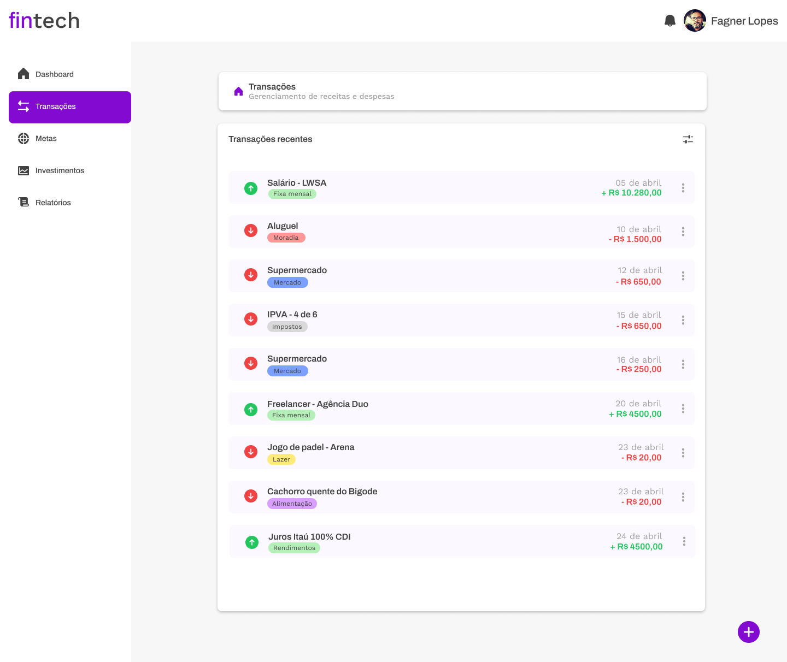

# Fintech App

Este é um projeto de interface para uma aplicação de controle financeiro pessoal, desenvolvido em HTML, CSS e Bootstrap, com foco em responsividade e experiência do usuário.

## Layout

O layout da aplicação segue o modelo abaixo e foi criado na etapa de prototipação:



## Funcionalidades
- Dashboard e navegação lateral (sidebar)
- Listagem de receitas e despesas
- Menu mobile fixo na parte inferior
- Drawer de usuário no mobile e dropdown no desktop
- Totalmente responsivo

## Como usar

1. Clone o repositório:
   ```bash
   git clone https://github.com/fagnerlopes/fiap-fintech.git
   ```
2. Abra o arquivo `index.html` em seu navegador.

## Tecnologias utilizadas
- HTML5
- CSS3 (custom properties, responsividade)
- Bootstrap 5
- Remix Icon
- Google Fonts (Archivo, Work Sans)

## Observação
Este projeto é apenas uma interface estática, sem backend ou integração com banco de dados.

---

Desenvolvido por Fagner Lopes 